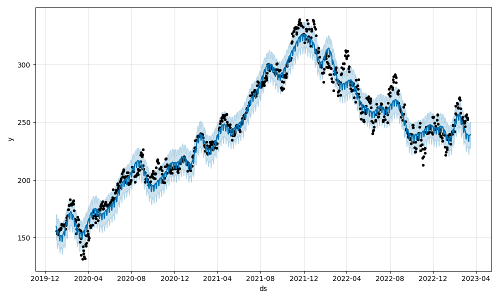
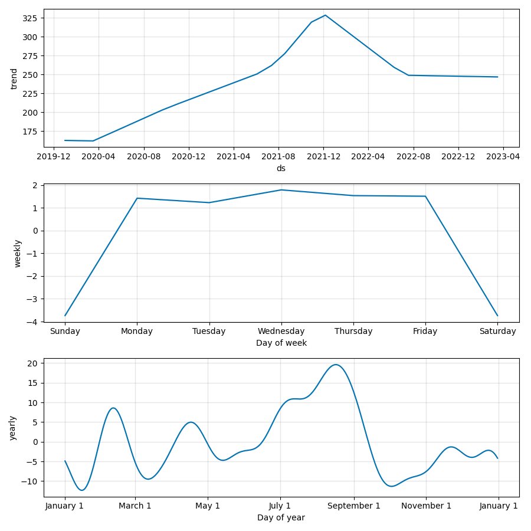

# Description

Deploying a time series model to predict stock prices as a RESTful API using FastAPI deployed to AWS EC2.

THe model is trained on historical stock data with yfinance, creates a new Prophet model, fits the model to the stock data, and then serializes and saves the model as a Joblib file. Then, the trained model is used to predict loads and deserializes the saved model, generates a new forecast, creates images of the forecast plot and forecast components. The model outputs a JSON file containing a dictionary of dates and forecasted values; e.g., {"07/02/2020": 200}).

The model can be executed using FastAPI with two arguments, a valid stock ticker and the number of days to predict. The ticker values are, for example, 'GOOG', 'AAPL', 'MSFT'. 

# FastAPI

## Link

http://35.87.98.236:8000/docs#/default/get_prediction_predict_post

## Screenshot

# Curl

curl --header "Content-Type: application/json" --request POST --data '{"ticker":"MSFT", "days":7}' http://35.87.98.236:8000/predict
